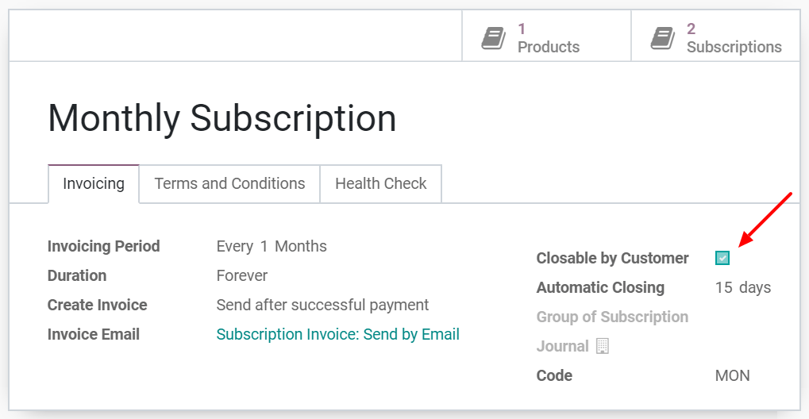
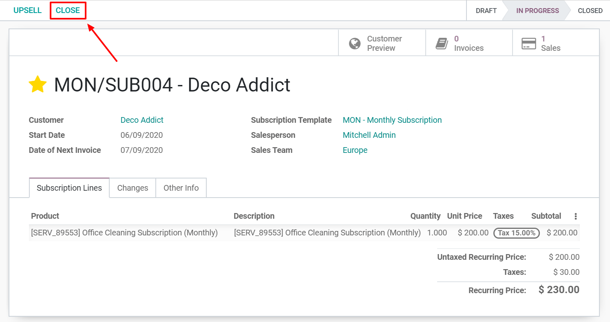

====================
Close a subscription
====================

Losing a customer is always difficult, especially if you put a lot of effort into getting them to
sign up for your products/services. This is understandable. However, many companies come up with
dubious methods to reduce the probability of this happening.

.. raw:: html

   
 <b>What is the right
   way to go?</b> 

1. If you adopt such methods, you will be among companies that actively and indirectly spread the
   phobia of subscriptions, who do not think about how negatively dissatisfied customers could impact
   their business and who frustrate the customers in a way or another. However, at some point, it is
   understandable that you do not want your customers to be involved in your subscription status.

2. If you do not adopt such methods, you will be among companies that continue to evolve in a
   long-term subscription business model, especially in an era of ultra-fast communications between
   dissatisfied customers, and who retain their customers by making it easier for them to leave if
   they want to. By giving them the opportunity to close their own subscriptions, your customers are
   not feel trapped because they subscribed to your products/services.

In summary, the **Odoo Subscriptions** application give you the possibility to choose what you want
to apply. You can decide whether to give your customers the option to close their subscriptions
whenever they want to or to restrict this possibility. It depends on you and we will show you how to
do that in our amazing application.

Configuration
=============

Go to :menuselection:`Subscriptions → Configuration → Subscription templates`. From there, you can
create a new *Subscription template* or modify an existing one. When editing your template, underneath
the *Invoicing tab*, you have the possibility to activate the option *Closable by customer*.
Once enabled, this option will give your customers the right to close their own subscriptions.

.. important::
   Be sure to check out our documentation on
   how to :doc:`Use subscription templates <../../subscriptions/configuration/subscription_templates>`
   to fully understand the importance of this feature in a basic flow using the
   **Odoo Subscriptions** application.

Close your first subscription
=============================

Once confirmed, a quotation becomes a sales order and a new subscription is automatically created.
Therefore, this subscription has the status *In progress*. From there, you have the possibility to
close the subscription.

.. important::
   Before closing a subscription, check out our documentation on how to
   :doc:`Use subscription templates <../../subscriptions/configuration/subscription_templates>`,
   :doc:`Create subscription products <../../subscriptions/configuration/subscription_products>` and,
   :doc:`Create a quotation using subscription products <../../subscriptions/sales_flow/create_a_quotation>`
   to fully understand how subscriptions are managed in the **Odoo Subscriptions** application.